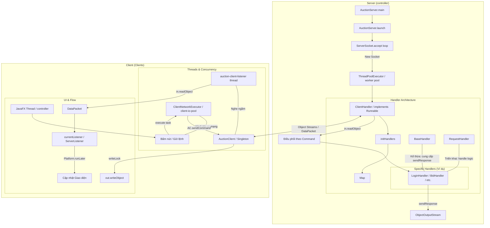

# Hệ Thống Đấu Giá Trực Tuyến

Dự án này được tái cấu trúc để có thể dễ dàng triển khai trên nhiều máy khác nhau và sẵn sàng để đẩy lên GitHub.

## Cấu trúc dự án
- `controller`: Module Server (Xử lý logic đấu giá và kết nối Database).
- `Clients`: Module Client (Giao diện người dùng JavaFX).
- `.gitignore`: Cấu hình các file không đẩy lên GitHub (build, logs, idea config).

## Yêu cầu hệ thống
- Java 25 trở lên.
- Maven 3.x.
- MySQL Database (Hiện đang cấu hình kết nối tới Azure MySQL).

## Hướng dẫn cấu hình

### 1. Cấu hình Server
Mở file `controller/src/main/resources/server.properties` và chỉnh sửa các thông số sau:
- `db.host`: Địa chỉ host của Database.
- `db.name`: Tên database.
- `db.user`: Tên đăng nhập database.
- `db.pass`: Mật khẩu database.
- `server.port`: Cổng mà Server sẽ lắng nghe (Mặc định: 8080).

### 2. Cấu hình Client
Mở file `Clients/src/main/resources/client.properties` và chỉnh sửa:
- `server.ip`: Địa chỉ IP của máy đang chạy Server.
- `server.port`: Cổng của Server (phải trùng với cấu hình ở Server).

## Hướng dẫn chạy dự án

### Cách 1: Chạy bằng Maven (Khuyên dùng khi phát triển)
1. **Chạy Server:**
   ```bash
   cd controller
   mvn clean javafx:run
   ```
   *(Hoặc chạy hàm main trong `network.AuctionServer`)*

2. **Chạy Client:**
   ```bash
   cd Clients
   mvn clean javafx:run
   ```
   *(Hoặc chạy hàm main trong `controller.Launcher`)*

### Cách 2: Đóng gói và chạy file JAR
1. Tại thư mục gốc của dự án, chạy lệnh:
   ```bash
   mvn clean package -DskipTests
   ```
2. Sau khi build xong:
   - File chạy của Server sẽ nằm tại: `controller/target/Server-1.0-SNAPSHOT.jar`
   - File chạy của Client sẽ nằm tại: `Clients/target/Clients-1.0-SNAPSHOT.jar`
3. Chạy lệnh:
   ```bash
   java -jar <tên-file-jar>
   ```

## Các lỗi thường gặp khi chạy trên máy khác

### 1. Lỗi phiên bản Java (UnsupportedClassVersionError)
- **Nguyên nhân:** Dự án đang dùng **JDK 25**. Nếu máy khác chỉ có JDK 21, 17... sẽ không chạy được.
- **Khắc phục:** Cài đặt JDK 25 trên máy đó hoặc đổi phiên bản Java trong `pom.xml` về bản thấp hơn và build lại.

### 2. Không kết nối được tới Server (Connection Refused / Timeout)
- **Nguyên nhân:** File `client.properties` vẫn đang để `server.ip=localhost`. Khi sang máy khác, `localhost` trỏ về chính nó chứ không trỏ về máy Server.
- **Khắc phục:** Mở file `Clients/src/main/resources/client.properties` và đổi `localhost` thành địa chỉ IP thực tế của máy chạy Server (Ví dụ: `192.168.1.15`).

### 3. Lỗi Firewall / Cổng (Port)
- **Nguyên nhân:** Windows Firewall chặn cổng 8080.
- **Khắc phục:** Mở cổng 8080 trên Firewall của máy Server hoặc tạm tắt Firewall để kiểm tra.

### 4. Lỗi File FXML (NullPointerException khi load FXML)
- **Nguyên nhân:** Do sử dụng đường dẫn tuyệt đối (File) thay vì Resource.
- **Khắc phục:** Tôi đã cập nhật mã nguồn để sử dụng `getClass().getResource()`. Hãy đảm bảo bạn đã chạy `mvn clean package` để đóng gói lại phiên bản mới nhất.

## Kiến trúc Hệ thống

Dưới đây là sơ đồ luồng hoạt động và cấu trúc mã nguồn của hệ thống Đấu giá:



### Giải thích cấu trúc:

#### Phía Server (`controller`)
*   **AuctionServer:** Điểm khởi đầu, quản lý cổng kết nối và sử dụng `ThreadPoolExecutor` để xử lý đa luồng hiệu quả.
*   **ClientHandler:** Đại diện cho mỗi kết nối Client. Nhiệm vụ chính là đọc gói tin (`DataPacket`) và điều phối tới các Handler cụ thể.
*   **Hệ thống Handler:** 
    *   `BaseHandler`: Cung cấp công cụ gửi phản hồi (`sendResponse`).
    *   `RequestHandler`: Interface định nghĩa cách xử lý một yêu cầu.
    *   Các Handler cụ thể (`LoginHandler`, `BidHandler`...) chứa logic nghiệp vụ riêng biệt.

#### Phía Client (`Clients`)
*   **AuctionClient:** Lớp Singleton quản lý kết nối duy nhất tới Server. Chứa `writeLock` để đảm bảo an toàn đa luồng khi gửi dữ liệu.
*   **Luồng lắng nghe (Listener):** Một luồng chạy ngầm liên tục nhận dữ liệu từ Server mà không làm treo giao diện.
*   **ClientNetworkExecutor:** Pool luồng riêng cho các tác vụ mạng, giúp tách biệt logic I/O ra khỏi luồng giao diện JavaFX chính.
*   **Cập nhật UI:** Sử dụng `Platform.runLater` để đảm bảo dữ liệu từ Server được hiển thị lên màn hình một cách an toàn.